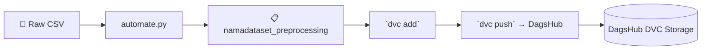

# Eksperimen SML — Customer Churn EDA & Preprocessing

Proyek ini adalah bagian dari **Kriteria 1 (Eksperimen Data)** submission Dicoding "Membangun Sistem Machine Learning".  

Dataset: [Telco Customer Churn](https://www.kaggle.com/datasets/blastchar/telco-customer-churn) — prediksi pelanggan yang berhenti berlangganan (*churn*).

---

## Struktur Folder

```
Customer-Churn-EDA/
├── namadataset_raw/
│   └── wa_customer_churn_total.csv      ← dataset mentah
├── preprocessing/
│   ├── Eksperimen_Rois-Hoiron.ipynb     ← notebook eksperimen (template MSML)
│   ├── automate_Rois-Hoiron.py          ← otomatisasi preprocessing (skilled)
│   └── namadataset_preprocessing/       ← output preprocessing siap latih
│       ├── X_train.csv
│       ├── X_test.csv
│       ├── y_train.csv
│       ├── y_test.csv
│       └── scaler.pkl
├── .github/workflows/ci.yml             ← CI otomatis preprocessing (advanced)
└── requirements.txt
```

---

## Cara Menjalankan

### 1. Clone repositori
```bash
git clone https://github.com/roiskhoiron/Customer-Churn-EDA.git
cd Customer-Churn-EDA
```

### 2. Install dependencies (runtime)
```
pip install -r requirements.txt
```

### 2a. Install development dependencies (untuk notebook & visualisasi)
```
pip install -r requirements-dev.txt
```

### 3. Jalankan notebook (eksplorasi manual)
```bash
jupyter notebook preprocessing/Eksperimen_Rois-Hoiron.ipynb
```
Notebook mencakup:
- **Data Loading** — memuat dataset dari `namadataset_raw/`
- **EDA** — statistik, visualisasi distribusi, korelasi, churn rate
- **Preprocessing** — handling missing values, encoding, feature engineering, SMOTE, scaling

### 4. Jalankan otomatisasi preprocessing (skilled)
```bash
python preprocessing/automate_Rois-Hoiron.py
```
Skrip ini membaca dataset mentah, melakukan seluruh langkah preprocessing, dan menyimpan hasil ke `preprocessing/namadataset_preprocessing/`.

### 5. CI Automation (advanced)
GitHub Actions di `.github/workflows/ci.yml` akan menjalankan `automate_Rois-Hoiron.py` secara otomatis setiap ada push ke branch `main`.

---

## Output Preprocessing

Setelah preprocessing selesai, file berikut tersedia di `preprocessing/namadataset_preprocessing/`:

| File | Deskripsi |
|------|-----------|
| `X_train.csv` | Fitur training (SMOTE + scaling) |
| `X_test.csv` | Fitur testing (scaling) |
| `y_train.csv` | Label training (SMOTE) |
| `y_test.csv` | Label testing |
| `scaler.pkl` | StandardScaler untuk inference |

File-file ini digunakan untuk **Kriteria 2 (modelling.py)** dan **Kriteria 3 (MLOps CI)**.

---

## 📦 Data Versioning dengan DVC

### 🎯 Tujuan
Proyek ini menggunakan **DVC** (Data Version Control) untuk melacak dan membagikan data preprocessing antar repositori (EDA → MLOps). Remote storage menggunakan **DagsHub**.

### 🧪 Bagi Data Scientist (Lokal)



**Workflow harian:**

```bash
# 1. Preprocessing data
python preprocessing/automate_Rois-Hoiron.py

# 2. Track hasil preprocessing dengan DVC
dvc add preprocessing/namadataset_preprocessing/

# 3. Simpan metadata (.dvc file) ke Git
git add preprocessing/namadataset_preprocessing.dvc
git commit -m "update: preprocessing data"

# 4. Upload data ke DagsHub
dvc remote modify dagshub password $DAGSHUB_TOKEN
dvc push

# 5. Push kode ke GitHub
git push
```

**Untuk mengambil data terbaru dari remote:**

```bash
export DAGSHUB_TOKEN=72ea8c5251856c29972ca84a12ff422323986208
dvc remote modify dagshub password $DAGSHUB_TOKEN
dvc pull
```

### 🤖 CI Automation dengan DVC

```yaml
# .github/workflows/ci.yml (sudah terintegrasi)
- name: DVC track and push
  env:
    DAGSHUB_TOKEN: ${{ secrets.DAGSHUB_TOKEN }}
  run: |
    dvc add preprocessing/namadataset_preprocessing/
    dvc remote modify dagshub password $DAGSHUB_TOKEN
    dvc push
```

> **Catatan:** Token DagsHub tidak disimpan di `.dvc/config`; disediakan melalui **GitHub Secrets** (`DAGSHUB_TOKEN`) saat CI berjalan.
